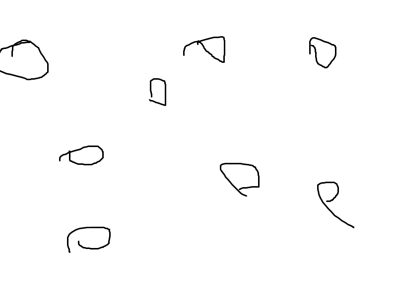
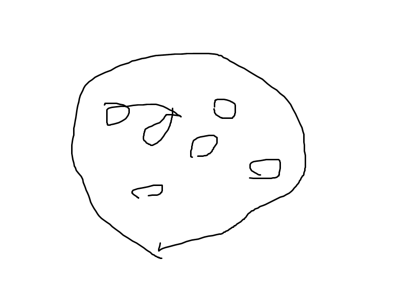

# 可読性について

実際の業務ではプログラムの開発からメンテナンスまでを全部一人で行う事は滅多な事がない限りはありません。

数人で分担して行う事が多いです。

自分だけプログラムを読めても、他の人が読めなければ、意味がありません。

他の人が読めるようにするために、可読性が高いコードを書く必要があります。

可読性を高くするために使われるのが、クラスやメソッドです。
# メソッドについて

処理をコンパクトにし、可読性を上げるための物。

```java
void prm(String args){
    return "a";
}

戻りの型 メソッド名(引数の型 引数名){
    return 戻り値;
}
```

void -- 戻り値の型

prm -- メソッド名

String args -- 引数の型と引数名

return "a" -- 戻り値

以下で解説します。

# メソッド名
これは任意で付ける物です。特に決まっていません。
例えばはさみを例に使います。はさみで出来る事は、紙を切る事です。この紙を切る道具に別の名前、例えば「あいうえお」が付けられたとしたら、はさみとは言わずに、あいうえおとその道具を呼んでいたでしょう。

これはメソッド名や変数名、引数名、クラス名にも言えます。名前はなんでもいいのです。

# 引数について


```java

int nedan = 100;

prm(nedan);

// ↑まで呼び出し側の処理
//↓から設計側の処理

void prm(int nedan){
    int price = nedan;
    System.out.println(price);
}

```

このようなコードがあったとします。

まず、変数「nedan」に100という数値を代入します。

100が入った変数をメソッドに引数に渡しています。

この時,

```java
int nedan = 100; //変数 nedanに100という値を入れる。

prm(nedan);

// ↑まで呼び出し側の処理
//↓から設計側の処理

void prm(int nedan){
    int price = nedan;
    System.out.println(price);
}

```

```java
int nedan = 100;

prm(100); //prmメソッドの引数にnedanを指定していたため、内部ではnedanが100に置き換わっている。

// ↑まで呼び出し側の処理
//↓から設計側の処理

void prm(int nedan){
    int price = nedan;
    System.out.println(price);
}

```

```java
int nedan = 100;

prm(100);

// ↑まで呼び出し側の処理
//↓から設計側の処理

void prm(int 100){ //呼び出し側の引数に100を指定したので、設計側の引数「nedan」が100に置き換わっている。
    int price = nedan;
    System.out.println(price);
}

```

```java
int nedan = 100;

prm(100);

// ↑まで呼び出し側の処理
//↓から設計側の処理

void prm(int 100){ 
    int price = 100; //元々、変数priceに引数nedanの値を代入していたので、nedanが100に置き換わったため、priceに100が置き換わる。
    System.out.println(price);
}

```


```java
int nedan = 100;

prm(100);

// ↑まで呼び出し側の処理
//↓から設計側の処理

void prm(int 100){
    int price = 100;
    System.out.println(100); //priceを出力する処理でpriceが100に置き換わっているので、100が出力される。
}

```

```java
int nedan = 100;

prm(100); //このメソッドが100を出力する処理のため、ここで100が出力される。

// ↑まで呼び出し側の処理
//↓から設計側の処理

void prm(int 100){
    int price = 100;
    System.out.println(100); 
}

```

# 戻り値について

```java
int nedan; //変数nedanの初期化

nedan = prm(100); 

System.out.println(nedan);

// ↑まで呼び出し側の処理
//↓から設計側の処理

int prm(int nedan){
    int price = 100;
    return price;
}

```

```java
int nedan; 

nedan = prm(100); //prmメソッドの引数に100を指定する

System.out.println(nedan);

// ↑まで呼び出し側の処理
//↓から設計側の処理

int prm(int nedan){
    int price = nedan;
    return price;
}

```

```java
int nedan; 

nedan = prm(100); 

System.out.println(nedan);

// ↑まで呼び出し側の処理
//↓から設計側の処理

int prm(int 100){ //呼び出し時に100がしていされたので、引数nedanが100に置き換わる。
    int price = nedan;
    return price;
}

```

```java
int nedan; 

nedan = prm(100); 

System.out.println(nedan);

// ↑まで呼び出し側の処理
//↓から設計側の処理

int prm(int 100){
    int price = 100; //priceにnedanの値を代入していたので、priceに100が入る。
    return price;
}

```

```java
int nedan; 

nedan = prm(100); 

System.out.println(nedan);

// ↑まで呼び出し側の処理
//↓から設計側の処理

int prm(int 100){
    int price = 100; 
    return 100; //priceを戻り値としていて、priceに100が入ってるので、100が戻り値となる。
}

```

```java
int nedan; 

nedan = 100; // 実行すると、メソッドの部分が戻り値に置き換わり、変数「nedan」に100が代入される。

System.out.println(nedan);

// ↑まで呼び出し側の処理
//↓から設計側の処理

int prm(int 100){
    int price = 100; /
    return 100;
}

```

```java
int nedan; 

nedan = 100

System.out.println(100); //変数nedanに100が代入されてるので、100が出力される。

// ↑まで呼び出し側の処理
//↓から設計側の処理

int prm(int 100){
    int price = 100; 
    return 100;
}

```

# 戻り値の型について

戻り値がなんの型になるか指定する。

javaでは変数なり、戻り値なり、なんの型になるか教えてあげる必要がある。

例えば、

int prm = 100;

これは左のintでprmに「整数」である100が入ると教えている。

String arg = "あいうえお";

これは左のStringでargに「文字列」であるあいうえおが入ると教えている。

これと同様の考えで、以下のコードを見てみると、分かりやすいと思う。

```java

int prm(){
    return 100;
}

String arg(){
    return "あいうえお";
}

```

## voidについて

```java

void not_return(){
    int price = 100;
}

```

一番左に「void」と書くことがある。これは戻り値が無い事を示している。

例えば
```java
void dispPrice(){
    System.out.println(price);
}
```
このようなコードがあるとして、これはreturnを使っていない。つまり戻り値が無いと言う事。

return無し = 戻り値が無い = void と覚えて良いと思うんだ。分かんないけど。

# ドットについて

クラス.メソッドと書くときに、クラスとメソッドの間にある「ドット」は、大きい纏まりの中にある小さなものを取り出すときに使う。

身近なものでたとえた使い方は、

岩手県.盛岡市
岩手県.北上市.コンピュータアカデミー

みたいな感じ。

例えばふでばこの中にある、シャーペンや消しゴムを取り出すプログラムを作りたいときに

ふでばこ.シャーペン();
ふでばこ.消しゴム();

となる。


# クラスについて

クラスは沢山あるメソッド等を一つに纏めたいときに使います。

これも筆箱や住所にたとえると

岩手県がクラスにになり、盛岡がメソッドになります。


 

これを

 

このように纏めるイメージです。

しかし、クラスはあくまで設計図でしかありません。

設計図を形にするためには、インスタンス化をして実体にする必要があります。

# インスタンス化について
設計図を形にする事です。

普段
```java

class Room{
    int price;
}

```

これはあくまでRoomクラスにpriceという変数が入ってるんだよと言ってるだけです。

このpriceを使うには、インスタンス化して実体にする必要があります。

勿論、クラス名は任意です。

```java

Room room = new Room();
```

一番左のRoomも「型」の一種です。

「int」や「String」と同じものです。

Roomと書いてる所はクラス名を書く必要があります。

そうじゃないと、何をインスタンス化するの？となります。

「何を」を明確にするための名前です。

# コンストラクタについて
インスタンス化をするときに、引数をしていする事により、色々省略できます。


```java

class Room{
    int room_number; //ルーム番号
    void setRoom(int number){
        room_number=number; 
    }

    vodi dispRoom(){
        System.out.println(room_number);
    }
}

Room room = new Room();

room.setRoom(1);
room.dispRoom();
```

このようなコードがあったとします。

これは「setRoom」メソッドでルーム番号をしていしています。

しかし、このために「setRoom」メソッドを作るのって結構無駄だと思いませんか？

それを解決してくれるのがコンストラクタです。

```java

class Room{
    int room_number; //ルーム番号
    
    Room(int number){
        room_number=number;
    }

    vodi dispRoom(){
        System.out.println(room_number);
    }
}

Room room = new Room(1);
room.dispRoom();
```

このようにルーム番号を決めるためのメソッド「setRoom」が消えました。

そして、インスタンス化をするときにルーム番号を指定出来るようになりました。

コンストラクタはクラス名と同じ名前で作る必要があり、「戻り値」という概念は存在しませんので型を教える必要がありません。そのため、void や int、Stringは必要無いです。


--- 

# 変数関連のエラー

```java

int charge = 200;
int price;

change = charge - price;

System.out.println(change);
```

お釣りを求めるコードがあります。

しかしこれはエラーになります。

変数「price」に値が入ってないからです。

「数字」と「無」を計算しようとしている、わけの分からない状態になっています。

```java

int charge = 200;
int price=50;

change = charge - price;

System.out.println(change);
```

このようにちゃんと「無」では無い状態。値を入れてあげることによりエラーが無くなります。

# if文について

「なんのためにIF文を使っているのか」
「どうしてIFが必要なのか」

を考えると更に書きやすくなると思います。


```java

int price = 100;

if(price==100){
    System.out.println("コーラ1本100円です。");
}

else if(price==200){
    System.out.println("コーラ1本200円です。");
}


else if(price==300){
    System.out.println("コーラ1本300円です。");
}

```

正直結構無理矢理なIF文にしました。

これはpriceに入っている数値によってコーラ1本の値段を変えるプログラムです。

priceに入っている値を調べるためにiF文を使っています。

しかし、これをよーく見てみましょう。

コーラ1本

円です。

この二つの文字は全てのIF文に共通していますよね？

変わってるのって１本の値段だけですよね？

これは
```java

int price = 100;

if(price==100){
    tanka=100;
}

else if(price==200){
    tanka=200;
}


else if(price==300){
    tanka=300;
}

System.out.println("コーラ1本" + tanka + "円です。");

```

このようにすることが出来ます。

わざわざ長いのを複数書く必要はありません。時間と労力の無駄です。


# 期末解説

```java

public class Taisaku3_1{
    public static void main(String[] args){

        haruki.dispName();
        haruki.dispWriter();

    }
}


class Book{
    String name = "ノルウェイの森";
    String writer = "村上春樹";

    void dispName(){

    }

}
```

スライドではこうなってましたね。

Taiasku3_1クラスをまず、見てみます。

haruki.~~となっているので、`haruki`が変数になっている事が分かります。
しかし、`haruki`という変数はどこにも定義されていません。
そのため

```java

public class Taisaku3_1{
    public static void main(String[] args){

        Book haruki = new Book();

        haruki.dispName();
        haruki.dispWriter();

    }
}


class Book{
    String name = "ノルウェイの森";
    String writer = "村上春樹";

    void dispName(){

    }

}
```

`haruki.dispName();`の上に`Book haruki = new Book();` と書いて変数を定義します。

次にスライドの実行結果を確認します。一行目は名前、二行目で著者を出力しています。
Taisaku3_1クラスで実行しているメソッドは`haruki.dispName();`と`haruki.dispWriter();`の二つになります。そのため、各メソッド1行ずつ出力する事が分かります。

`class Book`を見てみます。`void dispName(){}`となっているので、ここはメソッドになりますが、中身がありません。
メソッド名を読んでみると、デイスプネーム -> デイスプレイネーム -> 名前を表示となっています。変数にも`name`とありますね。この変数の中身を出力します。

いつもなら、`set~`メソッドを作りますが、今回は変数に事前に指定されてるので要りません。

出力形式を確認します。`本の名前は「ノルウェイの森」です`となっています。
ノルウェイの森は変数に入ってるので、置き換えると`本の名前は「name」です`となります。
文字列と変数は`+`で繋げる必要があるので、"本の名前は「"+name+"」です"となります

出力方法は`System.out.print~~();`なので、

```java

public class Taisaku3_1{
    public static void main(String[] args){

        Book haruki = new Book();

        haruki.dispName();
        haruki.dispWriter();

    }
}


class Book{
    String name = "ノルウェイの森";
    String writer = "村上春樹";

    void dispName(){
        System.out.println("本の名前は" + name + "です");
    }

}
```

となります。
しかし、実行するメソッドが二つなのに対して、1つしか定義されていません。二つ目は自分で作る必要があるようです。
先程名前を出すメソッドを作ったので、次はdispWriterの方ですね。

```java
public class Taisaku3_1{
    public static void main(String[] args){

        Book haruki = new Book();

        haruki.dispName();
        haruki.dispWriter();

    }
}


class Book{
    String name = "ノルウェイの森";
    String writer = "村上春樹";

    void dispName(){
        System.out.println("本の名前は" + name + "です");
    }

    void dispWriter(){
        System.out.println("著者は" + writer + "です");
    }

}
```

詳しい説明はほぼ名前と同じなので割愛しますが、このようになります。

#期末2

```java
public Taisaku3_2{
    public static void main(String[] args){
        Cake muffin = new Cake();
        Cake tart = new Cake();

        muffin.setData("マフィン", 250);
        muffin.dispPrice();
        tart.setData("タルト", 380);
        tart.dispPrice();
    }
}

public Cake{}
```

はい。スライドではこうなっています。`Taisaku3_2`クラスは既に完成しているようですが、`Cake`の方は何も無いですね。

では、まず`コンストラクタ`から見ていきましょう。インスタンス化した時に引数に何も指定してないですね。このため、コンストラクタはいらないです。

次にメソッドです。`setData`と`dispPrice`があります。

```java
public Taisaku3_2{
    public static void main(String[] args){
        Cake muffin = new Cake();
        Cake tart = new Cake();

        muffin.setData("マフィン", 250);
        muffin.dispPrice();
        tart.setData("タルト", 380);
        tart.dispPrice();
    }
}

public Cake{

    void setData(){}

    void dispPrice(){}
}
```

この二つのメソッドを定義します。
次にこのメソッドの引数を見ます。
文字列で名前、数値で値段を指定していることが分かります。

文字列はString, 数値はintなので

```java
public Taisaku3_2{
    public static void main(String[] args){
        Cake muffin = new Cake();
        Cake tart = new Cake();

        muffin.setData("マフィン", 250);
        muffin.dispPrice();
        tart.setData("タルト", 380);
        tart.dispPrice();
    }
}

public Cake{

    void setData(String namae, int nedan){}

    void dispPrice(){}
}
```

となります。
しかし、このままではsetDataで指定した名前と値段はsetDataメソッドでしか使えません。そのためプロパティを用意してそこに引数に渡された値を代入してあげます。
namaeは文字列、nedanは数値なので、それぞれ対応する変数、ここでは`name`と`price`を用意し、`name`を文字列、`price`を数値型で定義します。

```java
public Taisaku3_2{
    public static void main(String[] args){
        Cake muffin = new Cake();
        Cake tart = new Cake();

        muffin.setData("マフィン", 250);
        muffin.dispPrice();
        tart.setData("タルト", 380);
        tart.dispPrice();
    }
}

public Cake{
    String name; //プロパティ
    int price; //プロパティ

    void setData(String namae, int nedan){
        name = namae;
        price = nedan;
    }

    void dispPrice(){}
}
```

これで`setData`で指定された引数がCakeクラス内のどこででも、使えるようになりました。
指定したら次は出力する必要があります。

出力は`dispPrice`メソッドで行います。

出力形式がマフィンは1個250円ですとなっています。マフィンは変数`name`に、250は変数`price`に入ってる値ですよね。
これを置き換えるとnameは1個price円ですとなります

```java
public Taisaku3_2{
    public static void main(String[] args){
        Cake muffin = new Cake();
        Cake tart = new Cake();

        muffin.setData("マフィン", 250);
        muffin.dispPrice();
        tart.setData("タルト", 380);
        tart.dispPrice();
    }
}

public Cake{
    String name; //プロパティ
    int price; //プロパティ

    void setData(String namae, int nedan){
        name = namae;
        price = nedan;
    }

    void dispPrice(){
        System.out.println(name+"は1個"+price+"円です");
    }
}
```

となります。

# 期末3

```java

public class Taisaku3_3{
    public static void main(String[] args){
        int[] code = {101, 103, 104, 107, 109, 110, 112, 999};
        String[] name = { "クリップ","ボールペン","ファイル","替え芯", "消しゴム","マーカー","修正テープ"};
        int[] price = {150, 200, 300, 180, 90, 120, 170 };
        int x = 112; // 検索するコード
    }
}
```

まず、番兵法は目的のデータ(数字)を配列の最後に入れて100%見つかるようにするためのアルゴリズムです。これをするとなんか色々らくになるらしい。


forとwhile両方解説しますが、まずはforから

for文の`for ()`の中は`for(変数の初期化; ループ条件(YESの時にループ。Noになったら終了); 増分)`の3要素からなっています。

1つ1つ見ていきます。

変数の初期化: 

今回はカウンター変数としてiを使います。その為`i=0`としますが、型を指定する必要があるので、`int i=0`とします。

しかし、このままではiをfor文の中でしか使えません。なので

```java

int i;
for (i=0 ...)
```
とします。

ループ条件:

配列をループさせる時、配列に10個しか要素が無いのに、11個目を探索しようとするとエラーが出ます。

そのため `i<code.length`としてiがcodeの要素数より小さい事を条件に入れます。
次に要素が一致したら、ストップさせたいので、`code[i] != x`とします。codeのi番目の要素とxが一致したらループを止めます。

`==`が同じなのに対し、!=は`違う`を意味しています。

この二つの条件を `&&`で繋げます。

```java
int i;
for (i=0; i<code.length && code[i] != x; i++){}
```
増分の説明は省きますが、forはこうなります。`{}`の中は何も書く必要はありません。何もしないから。

次に`while`です。

whileの()の中は条件だけになっています。
先程のforの条件を入れればOKです。

```java
int i=0;
while (i<code.length && code[i] != x){
    i++;
}
```

こちらもwhileの前でiを定義してあげて、iを増やす所が無いので、{}の中でやります。

そして、この`i`を使い、ループを抜けた後に`i`がcodeの要素数より少なかったら、見つかった旨を。同じだったら、見つからなかった旨を表示します。番兵法が見つけたい数字を配列の最後に入れる仕様だからね！！

\nを挿入すると、その位置で改行されるので、printlnを複数個使う必要がなくなります。

```java
if (i<code.length){
    System.out.println("商品番号: " + code[i] + "\n商品名  :" + name[i] + "\n単  価: " + price[i] + "円");
}
else {
    System.out.println("該当の商品番号はありません");
}

```
となります。

printfを使う場合は
```java
if (i<code.length){
    System.out.printf("商品番号: %3d\n商品名  : %5s\n単  価: %3d円" + code[i], name[i], price[i]);
}
else {
    System.out.println("該当の商品番号はありません");
}
```
となります。

これを全て組み合わせると

```java
//for

public class Taisaku3_3{
    public static void main(String[] args){
        int[] code = {101, 103, 104, 107, 109, 110, 112, 999};
        String[] name = { "クリップ","ボールペン","ファイル","替え芯", "消しゴム","マーカー","修正テープ"};
        int[] price = {150, 200, 300, 180, 90, 120, 170};
        int x = 112; // 検索するコード
        int i;
        for (i = 0; i < code.length && code[i]!=x; i++) {
        }

        if (i<code.length){
            System.out.println("商品番号: " + code[i] + "\n商品名  :" + name[i] + "\n単  価: " + price[i] + "円");
        }
        else {
            System.out.println("該当の商品番号はありません");
        }

        //or

        if (i<code.length){
            System.out.printf("商品番号: %3d\n商品名  : %5s\n単  価: %3d円" + code[i], name[i], price[i]);
        }
        else {
            System.out.println("該当の商品番号はありません");
        }
    }
}```

```java
//while

public class Taisaku3_3{
    public static void main(String[] args){
        int[] code = {101, 103, 104, 107, 109, 110, 112, 999};
        String[] name = { "クリップ","ボールペン","ファイル","替え芯", "消しゴム","マーカー","修正テープ"};
        int[] price = {150, 200, 300, 180, 90, 120, 170};
        int x = 112; // 検索するコード
        int i=0;
        while(i < code.length && code[i]!=x) {
            i++;
        }

        if (i<code.length){
            System.out.println("商品番号: " + code[i] + "\n商品名  :" + name[i] + "\n単  価: " + price[i] + "円");
        }
        else {
            System.out.println("該当の商品番号はありません");
        }

        //or

        if (i<code.length){
            System.out.printf("商品番号: %3d\n商品名  : %5s\n単  価: %3d円" + code[i], name[i], price[i]);
        }
        else {
            System.out.println("該当の商品番号はありません");
        }
    }
}```